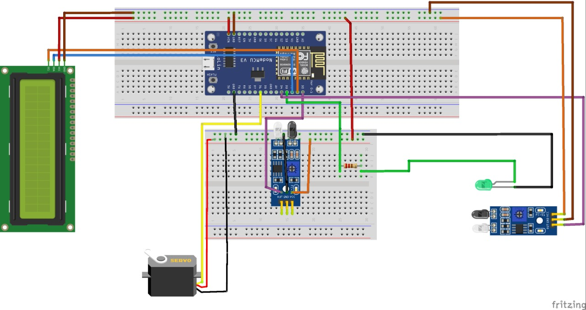
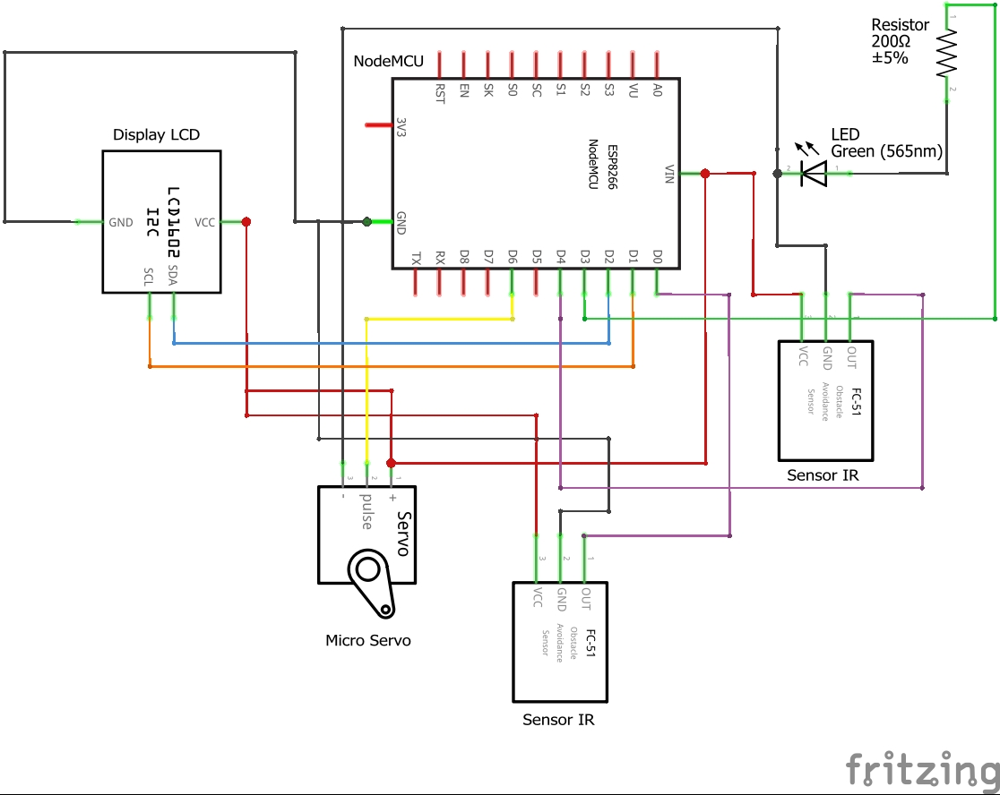

# Smart-Parking

Trabalho de Smart Parking realizado pelas alunas Marina Rodrigues de Rezende e Yasmin Santos Fragomeni. O intuito deste foi realizar uma abordagem aplicada de objetos inteligentes interconectados. Escolhemos esse caso de estudo pois faz parte do cotidiano. Sua reprodução pode ser seguida utilizando os passos abaixo.

## Pré-Requisitos

### Software

* Node RED
* Arduino IDE

### Hardware

* 1 Módulo WIFI ESP8266 NodeMCU
* 1 Micro Servo 9g SG90 TowerPro
* 2 Sensores de Obstáculo Infravermelho IR
* 1 Display LCD 16x2 I2C Backlight Azul
* 120 Jumpers 10 cm
* 1 Led Verde
* 1 Resistor 1/4 W
* 1 Protoboard 830 pontos
* 1 Protoboard 400 pontos

## Montagem do circuito

Abaixo, pode-se encontrar um modelo elaborado no Fritzing pela dupla, a fim de auxiliar na montagem deste projeto.

## Arduino IDE

Cole ou importe o código do SmartParking presente na pasta *ArduinoIDE*, na sua aplicação. É importante ressaltar que o projeto só irá funcionar corretamente mediante à instalação das seguinte bibliotecas:

* ESP8266WiFi
* PubSubClient
* Servo
* LiquidCrystal_I2C

## Node Red

Importe o arquivo JSON presente na pasta *NodeRed*, em seu NodeRed. Assim, você terá como realizar a conexão com o protocolo MQTT.

## Rodando o código

Com ambas aplicações abertas, compile o sketch na ArduinoIDE e pronto! Você tem seu mini Smart Parking funcionando.
